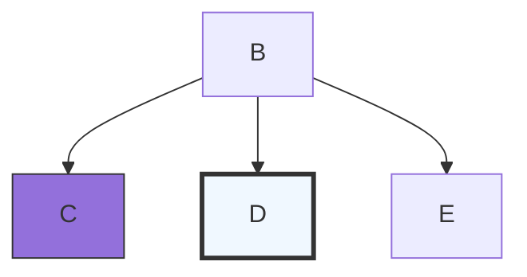

# git codes

 ```bash
git clone https://github.com/Zelmoghazy/demo-repo.git
```

```
git satus
```

```bash
git add . #track all files listed
```

```bash
git commit -m "title" -m "description"
```

```
git push origin main
```

```bash
git init #initialize git repo from a local folder
```

```bash
git branch #check which branch you are on
```

```bash
git checkout -b branchname #create new branch
```

```bash
git checkout main #switch branches
```

```bash
git diff #show changes of a branch
```

```bash
git merge  #merge branch with main
```

```bash
git pull  #pull merge from github
```

```bash
git branch -d branchname #delete branch after merge
```

|table1|table2|
|:----:|:----:|
|a|b|

- [x] Milk
- [ ] rice
- [ ] eggs



 <table>
 <tr>
 <th> Good </th>
 <th> Bad </th>
 </tr>
 <tr>
 <td>

 ```c++
 //type code here
 int foo() {
     int result = 4;
     return result;
 }
 //---------------
 ```

 </td>
 <td>

 ```c++
 ///type code here
 int foo() { 
     int x = 4;
     return x;
 }
 //------------
 ```

 </td>
 </tr>
 </table>

<!DOCTYPE html>
<html>
<body>

<h1 style="font-family:cascadia code;">This is a heading</h1>
<p style="font-family:cascadia code;">This is a paragraph.</p>

</body>
</html>

---

<!DOCTYPE html>
<html>
<body>

<h1 style="text-align:center;">Centered Heading</h1>
<p style="text-align:center;">Centered paragraph.</p>

</body>
</html>

---
